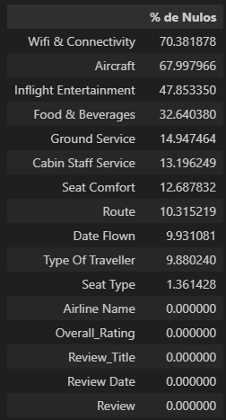
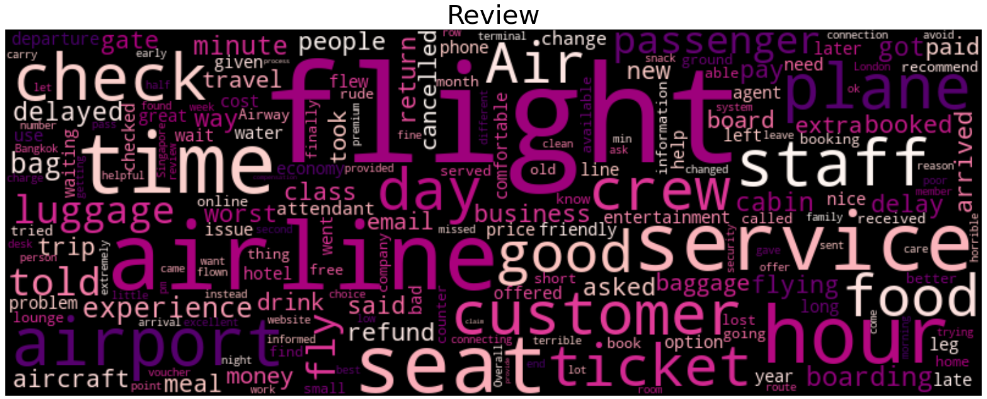
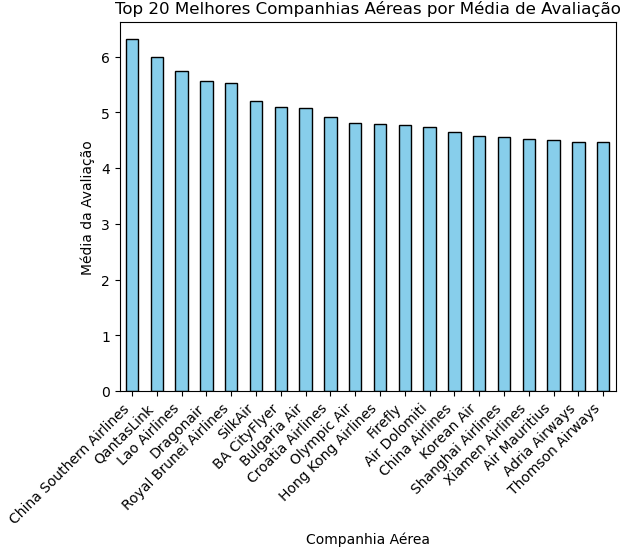
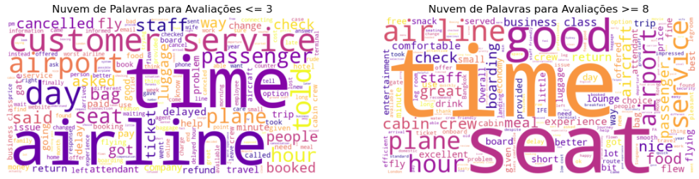
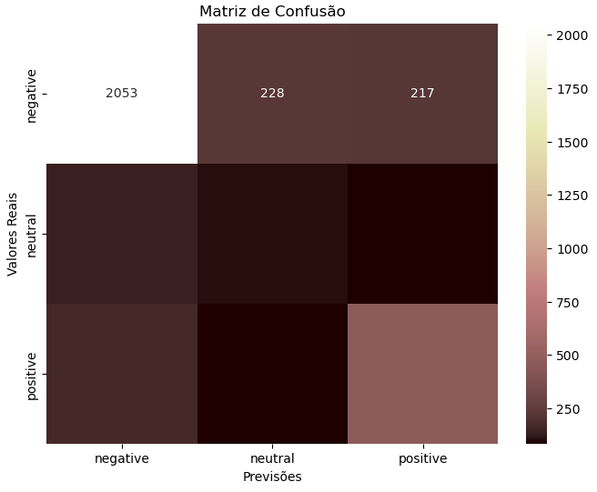

# Análise de Sentimento em Viagens Aéreas de Diferentes Companhias ✈️

Neste dataset, realizei as seguintes etapas: 
- [x] Pré-processamento com tratamento de nulos
--> Neste dataset, algumas colunas possuíam muitos valores nulos. Portanto, foi necessário substituir os dados numéricos pela média e os categóricos pela moda.

- [x] Tokenização e Remoção de StopWords
--> Nesta etapa, foi feita a Tokenização, que serve para transformar os textos para as máquinas entenderem, e remoção de StopWords (que são palavras que constantemente aparecem em avaliações mas não dão sentido para o modelo, como artigos, preposições, pronomes). Aqui visualizamos uma nuvem de palavras com as palavras mais frequentes neste dataset:

- [x] Análise Exploratória dos Dados
--> Nesta etapa, algumas análises comparando colunas foram realizadas. Um exemplo muito interessante é analisar quais são as companhias aéreas melhor avaliadas (relação entre as colunas Overall_Ratings e Airline Names):

--> Além disso, para verificar quais as palavras mais frequentes dependendo da avaliação, foram feitas essas duas nuvens de palavras: uma para avaliações menores ou iguais a 3, e outra com avaliações maiores ou iguais a 8.

- [x] Criação de diferentes modelos de Classificação (Naive Bayes, SVM, Logistic Regression, Random Forest e XGBoost) para analisar textos e ratings
--> Para ilustrar o desempenho de um dos modelos que foi testado, a Matriz de Confusão, através de um heatmap, demonstra quanto o modelo acertou ou errou nos valores reais em comparação com os valores previstos.

- [x] Análise do impacto de atrasos no NPS (Net Promoter Score, métrica utilizada para avaliar a recomendação/satisfação dos clientes)
--> Para esta etapa, foi necessário criar uma nova coluna que indica se a Companhia Aérea atrasa ou não, tudo isso dependendo das palavras presentes nas avaliações que resultaram em sentimentos positivos, negativos ou neutros sobre a empresa. 

--> Após a criação desta coluna, o impacto do atraso foi analisado quando comparado ao valor do NPS de cada Companhia Aérea. 
